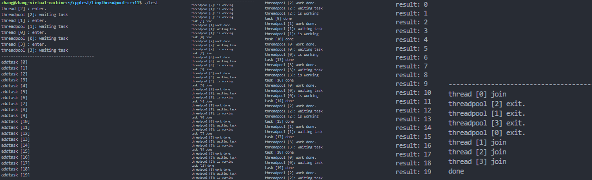

<!--
 * @Author: zzzzztw
 * @Date: 2023-02-27 15:41:34
 * @LastEditors: Do not edit
 * @LastEditTime: 2023-03-08 14:56:38
 * @FilePath: /cpptest/tinythreadpool-c++11/README.md
-->
# 基于c++11实现一个线程池
## 1. 线程池原理
1. 通过管理一个任务队列、线程队列，将主线程中用户提交任务到一任务队列中，空闲的线程将从任务队列中获取任务并执行，用户可以异步的获取提交任务的执行结果。  
2. 线程池调度策略为：任务队列无上限，同时执行任务的数量固定，有空闲线程时，获取队列中的队头任务。    
3. 线程池是服用的，线程池中的线程创建后不销毁，自导线程池关闭退出。每个线程创建后循环从任务队列中获取任务并执行。
4. 线程池和任务队列需要匹配，是典型的消费者-生产者模型，需要解决资源访问冲突，当任务为空时，线程应该阻塞，即需要实现线程安全和有同步机制的任务队列。 
## 2. 安全队列的实现
1.由于需要任意类型的队列数据，因此需要进行模板实现，这里简单使用std::mutex限制并发访问。  
直接给出任务队列的完整代码
```cpp
template<typename T>
template<typename T>
class SafeQueue{
public:

    SafeQueue() = default;
    SafeQueue(SafeQueue &&s) =  default;
    SafeQueue& operator= (SafeQueue&& s) = default;

    void enqueue(const T& t){
        std::unique_lock<std::mutex>locker(mtx_);
        que_.emplace(t);
    }

    void enqueue(T &&t){
        std::unique_lock<std::mutex>locker(mtx_);
        que_.emplace(t);
    }


    bool dequeue(T& t){//队列为空也能返回结果
        std::unique_lock<std::mutex>locker(mtx_);

        if(que_.empty())return false;

        t = std::move(que_.front());
        que_.pop();
        return true;
    }

    void clean(){//用于退出
        std::unique_lock<std::mutex>locker(mtx_);
        while(!que_.empty())que_.pop();
    }

    bool empty(){
        std::unique_lock<std::mutex>locker(mtx_);
        return que_.empty();
    }

    int size(){
        std::unique_lock<std::mutex>locker(mtx_);
        return que_.size();
    }

    ~SafeQueue(){
        clean();
    }

private:
    std::mutex mtx_;
    std::queue<T>que_;
    
};

```
## 3. 线程池的实现
### 3.1 提交任务函数addtask的实现
线程池中最重要的方法就是负责向任务队列中添加任务。提交函数应满足一下两点：  
1. 接受任意数量类型，任意个数的参数的任何函数（普通函数，lambda等）
2. 立即返回结果，避免阻塞主线程，这里的“结果”是指能够延迟获取包含任务执行结束的结果。  
3. 完整代码如下：
```cpp
 template<typename F, typename ...Args>
    auto AddTask(F&&f, Args &&...args)->std::future<decltype(f(args...))>{
        //获取根据函数和参数，获得的推断返回结果类型
        using ret = decltype(f(args...));
        //输入的函数指针和可变长参数绑定到一个 std::function<ret()>func上
        std::function<ret()>func = std::bind(std::forward<F>(f),std::forward<Args>(args)...);
        //使用packaged_task将函数打包成一个shared_ptr对象，用于之后get_future()异步获得结果
        auto task_ptr = std::make_shared<std::packaged_task<ret()>>(func);
        //进一步将上述结果绑定成一个std::function<void()>函数，任务队列中的元素类型
        std::function<void()> wrapper_func = [task_ptr](){
            (*task_ptr)();
        };
        /* queue_.enqueue([task_ptr](){
            (*task_ptr)();
        })*/
        queue_.enqueue(wrapper_func);//放入任务队列
        cv_.notify_one();//唤醒一个线程
        //返回当前任务future指针，使用get()函数等待任务执行结果
        return task_ptr->get_future();
    }
```
这里用到多个c++11新特性:  
1. ```template<typename F, typename ...Args>```是c++11引入的可变模板参数    
2. ```auto AddTask(F&&f, Args &&...args)->std::future<decltype(f(args...))>```是尾返回值推导，c++14可以直接使用auto来进行类型推导不需要尾返回值。 
3. 使用```std::function<>```和```std::bind()```将可变参数包装并绑定到一个特殊函数func上，这里我们注意到```bind()```中出现了一个```std::forward<T>()```的特殊方法，```std::forward<T>()```又称完美转发，将保留参数的引用类型进行转发（lvalue/rvalue）  
注意 std::bind()有四种常用用法
```cpp
//1.绑定普通函数
double callback(double x, double y){ return x * y; }
auto cb = std::bind(callback,std::placeholders::_1, 2);
std::cout<<cb(10)<<std::endl;
//bind的第一个参数是函数名，普通函数做实参时，会隐式转换成函数指针，因此等价于bind(&callback,_1,2);
// _1表示占位符，位于<functional>文件中
// 传入参数被_1占用，传入10，实际调用cb(10,2)

//2.绑定成员函数
class Base
{
    void display(int a, int b){
        cout<<a + b <<endl;
    }
};

int main{
    Base bs;
    auto func = bind(&Base::display, &bs,placeholder::_1, placeholder::_2);
    func(10,20);
}
//绑定成员函数时，第一个参数表示对象的成员函数指针，第二个参数表示对象的地址
//必须现实的指定&Base::display，因为编译器不会将对象的成员函数隐式的转换成函数指针
//使用成员函数的指针时，必须知道该指针属于那个对象，因此第二个参数必须传入对象地址

//3.绑定类中其他非静态成员函数

class Base
{
public: 
    Base(int a,int b):a(a),b(b){}
    ~Base(){};
    void work(){
        auto func = bind(&Base::test,this,placeholder::_1, placeholder::_2);
        func(a,b);
    }
    void test(int a,int b){
        cout<<a + b<<endl;
    }
private:
    int a;
    int b;
};
//bind绑定了其他成员函数函数可以函数来构造bind对象  
//bind函数的第二个参数是this,它指向当前对象，通过它可以访问当前对象的所有成员）

//4.用于可变参数模板
template<typename F,typename ...Args>
auto test(F&& f, Arges&& ...args)->std::future(decltype(f(...args)))
{
    ...
    auto func = std::bind(std::forward<F>(f), std::forward<Args>(args)...);
    ...
}
```
4. 这里的```F&& f```和```Args&&... args```不是右值引用的意思，在可变长模板中是万能引用的意思，当```T```为模板时，```T&&```的作用是保持值的类型进行转发。
5. ```std::packaged_task```与```std::future<>```配和使用，前者用来封装任何可以调用的目标并被子线程执行，后者在得到结果时，主线程可以通过```get_future()```来异步调用前者执行的结果
6. 使用智能指针```std::shared_ptr<>()```方法声明智能指针，并将```function<ret()>```声明的func传入，目的是将```std::packaged_task```对象的所有权转移到线程池中，否则这个临时对象将在addtask函数执行后销毁。
7. 最终将包装好回调函数```f```和其参数的```task_ptr```放入任务队列。

### 3.2 工作线程
1. 工作线程中需要3个主要的函数,工作函数```ThreadWorker()```，初始化线程池函数```init()```和关闭线程池函数```shutdown()```。
2. 为了保持多线程中的一致性，私有函数需要之前定义的安全队列,锁，条件变量,原子操作的bool类型的stop_：
```cpp
private:
    SafeQueue<std::function<void()>>queue_;
    std::vector<std::thread>threads_;
    std::mutex mutex_;
    std::condition_variable cv_;
    std::atomic<bool>stop_;
```
3. 工作函数,为了清晰我们在线程池中创建私有的成员类ThreadWorker作为内置线程工作类，执行真正工作：
```cpp
    class ThreadWorker{
    public:
        ThreadWorker(ThreadPool* pool, int id):pool_(pool),id_(id){};
        void operator()(){
            printf("thread [%d] : enter.\n",id_);
            std::function<void()>func;
            bool hastask = false;

            while(!pool_->stop_){
                {
                    std::unique_lock<std::mutex>locker(pool_->mutex_);
                    printf("threadpool [%d]: waiting task\n",id_);
                    pool_->cv_.wait(locker,[&]{
                        if(pool_->stop_)return true;
                        return !pool_->queue_.empty();
                    });

                    hastask = pool_->queue_.dequeue(func);
                }

                if(hastask){
                    printf("threadpool [%d]: is working\n",id_);
                    func();
                    printf("threadpool [%d] work done.\n",id_);
                }
            }

            printf("threadpool [%d] exit.\n",id_);

        }
    private:
        ThreadPool* pool_;
        int id_;
    };
```
在这里重点关注重载（）操作的```void operator()()```，类似仿函数，工作时传入thread中执行任务的取出和执行，使用了while循环，在线程池处于工作时循环从任务队列中提取任务。利用条件变量，在任务队列为空时阻塞当前线程，等待上文中的Addtask函数添加任务后发出的通知。在任务队列不为空时，我们将任务队列中的任务取出，并放在事先声明的基础函数类func中。成功取出后便立即执行该任务。
## 4. 测试代码和测试结果
### 4.1 测试代码：
```cpp
#include <iostream>
#include "./threadpool.h"

int main(){
    ThreadPool pools(4);
    pools.init();
    std::this_thread::sleep_for(std::chrono::seconds(1));

    printf("---------------------------------------\n");

    std::vector<std::future<int>>vec;
    
    for(int i = 0;i<20;i++){
        printf("addtask [%d]\n",i);
        vec.push_back(pools.AddTask([i](){
            std::this_thread::sleep_for(std::chrono::microseconds(rand()%500+100));
            printf("task [%d] done\n",i);
            return i;
        }));
    }
    printf("---------------------------------------\n");

    std::this_thread::sleep_for(std::chrono::seconds(5));

    for(size_t i = 0;i<vec.size();i++){
        printf("result: %d \n",vec[i].get());
    }

    printf("---------------------------------------\n");

    

    return 0;

}
```
### 4.2 测试结果
